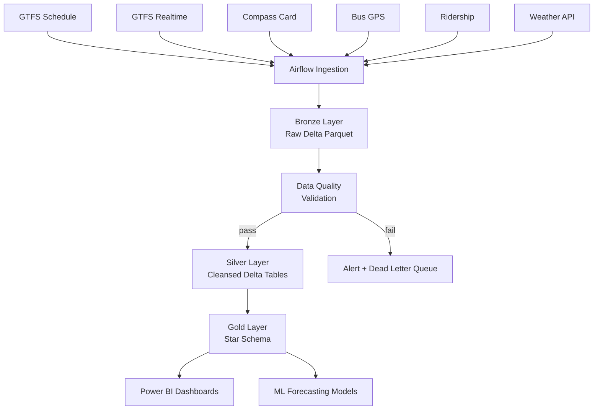
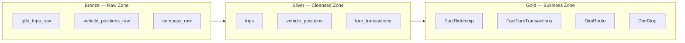

# TransLink Smart Transit Platform
### Unified Analytics & Operations Intelligence — Modern Data Platform

> A production-style portfolio project modelled on real transit data engineering challenges.  
> Demonstrates end-to-end lakehouse architecture, data quality engineering, ML forecasting, and executive reporting.

---

## Business Context

TransLink operates Metro Vancouver's bus, SkyTrain, SeaBus, and West Coast Express networks — one of North America's most complex multi-modal transit systems. Data about vehicles, fares, ridership, and schedules is generated continuously across hundreds of systems, but historically lives in disconnected silos:

- Operations cannot see real-time delay propagation across routes
- Finance relies on manually exported Compass Card reports days after close
- Planning makes capacity decisions from static quarterly ridership snapshots
- Executives receive one-week-old KPI decks assembled by hand

**The business cost is real:**
- Dispatchers react to incidents rather than predict them
- Service adjustments are slow because decision data is stale
- Revenue leakage from undetected fare anomalies
- Inability to model network impact of special events

**This platform solves it** by consolidating all transit data into a single, observable, analytics-ready lakehouse — enabling real-time operations intelligence, trusted reporting, and ML-driven forecasting.

---

## Architecture Overview

```
DATA SOURCES          INGESTION            STORAGE              SERVING
────────────────      ────────────────     ─────────────────    ──────────────────
GTFS Schedule   ──┐
GTFS Realtime   ──┤  Airflow DAGs    ──>  Bronze (raw)    ──>  Power BI
Compass Card    ──┼  Azure Data      ──>  Silver (clean)  ──>  Azure SQL
Bus GPS         ──┤  Factory         ──>  Gold (business) ──>  ML Models
Ridership       ──┤  Event Hubs              │
Weather API     ──┘  (streaming)     ──>  DQ Layer ───────>  Alerts / Observability
```

**Medallion Architecture** (Bronze → Silver → Gold) implemented on:
- **Microsoft Stack**: Azure Data Lake Gen2, Microsoft Fabric Lakehouse, Databricks, Delta Tables, ADF, Power BI
- **Open Source Stack**: Python, Apache Airflow, PostgreSQL, DuckDB, Parquet, Power BI Desktop

---

## Technology Stack

### Microsoft / Production Stack

| Layer | Technology | Rationale |
|---|---|---|
| Orchestration | Azure Data Factory + Fabric Pipelines | Native ADF triggers, lineage tracking, retry policies |
| Storage | ADLS Gen2 / OneLake | Hierarchical namespace, Delta Log, cost-effective tiering |
| Compute | Azure Databricks | PySpark for scalable transformations; Unity Catalog for governance |
| Warehouse | Microsoft Fabric Warehouse / Azure SQL | DirectLake mode for Power BI sub-second refresh |
| Reporting | Power BI Premium | Row-level security, paginated reports, executive scorecards |
| Streaming | Azure Event Hubs | Real-time vehicle position ingestion at scale |
| Quality | Great Expectations + dbt tests | Declarative quality contracts per domain |

### Open Source / Portfolio Stack

| Layer | Technology | Rationale |
|---|---|---|
| Orchestration | Apache Airflow | DAG-first scheduling; production-proven retry + alerting |
| Storage | Local / S3 → Parquet | Columnar, portable, schema-preserving |
| Compute | Python + PySpark | Pandas for dev, PySpark for scale-out |
| Warehouse | PostgreSQL + DuckDB | DuckDB for fast analytical queries on Parquet; Postgres for transactional |
| Reporting | Power BI Desktop | Free, connects to any source |
| Quality | Great Expectations | Open-source expectation suites |
| CI/CD | GitHub Actions | Automated DAG validation + quality test runs on push |

---

## Data Sources

| Source | Format | Frequency | Business Value |
|---|---|---|---|
| GTFS Static Schedule | ZIP → CSV | Weekly publish | Route, stop, trip, calendar reference data |
| GTFS Realtime | Protobuf | 30-second feed | Vehicle positions, trip updates, service alerts |
| Compass Card Transactions | CSV extract | Daily batch | Fare revenue, tap-on/tap-off ridership |
| Bus GPS Telemetry | JSON stream | Continuous | Headway adherence, dwell time, speed profiles |
| Ridership Counts | CSV | Daily | APC passenger counts per trip/stop |
| Open-Meteo Weather | REST API | Hourly | Delay correlation, demand modelling |
| HERE / TomTom Traffic | REST API | 15-minute | Road congestion impact on surface routes |

---

## Medallion Architecture

### Bronze Layer — Raw Zone
- **Purpose**: Immutable, append-only landing zone. No transformations.
- **Format**: Delta Parquet with ingestion timestamp metadata
- **Retention**: 90 days full fidelity, then archive tier
- **Key principle**: If something breaks downstream, Bronze is the recovery point

**Sample tables:**
```
bronze.gtfs_trips_raw          -- raw trip records from GTFS ZIP
bronze.gtfs_realtime_raw       -- protobuf-decoded vehicle positions
bronze.compass_transactions_raw -- raw fare tap events
bronze.bus_gps_raw             -- JSON telemetry payloads
bronze.ridership_raw           -- APC count files as-received
bronze.weather_raw             -- API response JSON
```

### Silver Layer — Cleansed Zone
- **Purpose**: Standardised, deduplicated, type-cast, schema-enforced records
- **Format**: Delta Tables with schema evolution enabled
- **Key transforms**: Null handling, duplicate detection, GPS validation, timezone normalisation

**Sample tables:**
```
silver.trips                   -- standardised trip master
silver.vehicle_positions       -- validated, deduplicated GPS feed
silver.fare_transactions       -- parsed tap-on/tap-off pairs
silver.ridership               -- APC counts with stop/route joins
silver.weather                 -- hourly weather aligned to Metro Vancouver
```

### Gold Layer — Business Zone
- **Purpose**: Analytics-ready star schema. Source of truth for reporting and ML.
- **Format**: Azure SQL / Fabric Warehouse
- **Key principle**: Gold tables have SLAs. Nothing untested reaches Gold.

---

## Data Model

### Fact Tables

```sql
-- FactRidership: passenger boarding events
CREATE TABLE gold.FactRidership (
    ridership_key     BIGINT IDENTITY PRIMARY KEY,
    date_key          INT NOT NULL,           -- FK → DimDate
    route_key         INT NOT NULL,           -- FK → DimRoute
    stop_key          INT NOT NULL,           -- FK → DimStop
    vehicle_key       INT NOT NULL,           -- FK → DimVehicle
    weather_key       INT NOT NULL,           -- FK → DimWeather
    trip_id           VARCHAR(50),
    boardings         INT,
    alightings        INT,
    load_factor       DECIMAL(5,2),           -- % of capacity
    scheduled_time    DATETIME,
    actual_time       DATETIME,
    delay_minutes     DECIMAL(6,2),
    ingested_at       DATETIME DEFAULT GETUTCDATE()
);

-- FactFareTransactions: Compass Card tap events
CREATE TABLE gold.FactFareTransactions (
    transaction_key   BIGINT IDENTITY PRIMARY KEY,
    date_key          INT NOT NULL,
    route_key         INT NOT NULL,
    stop_key          INT NOT NULL,
    card_type_key     INT NOT NULL,
    transaction_type  VARCHAR(20),            -- tap_on / tap_off / transfer
    fare_amount       DECIMAL(8,2),
    concession_flag   BIT,
    transfer_flag     BIT,
    ingested_at       DATETIME DEFAULT GETUTCDATE()
);

-- FactBusMovement: GPS telemetry aggregated per trip-segment
CREATE TABLE gold.FactBusMovement (
    movement_key      BIGINT IDENTITY PRIMARY KEY,
    date_key          INT NOT NULL,
    vehicle_key       INT NOT NULL,
    route_key         INT NOT NULL,
    segment_start_key INT NOT NULL,
    segment_end_key   INT NOT NULL,
    avg_speed_kmh     DECIMAL(6,2),
    dwell_seconds     INT,
    headway_seconds   INT,
    distance_km       DECIMAL(8,3),
    ingested_at       DATETIME DEFAULT GETUTCDATE()
);

-- FactServicePerformance: on-time performance by trip
CREATE TABLE gold.FactServicePerformance (
    performance_key   BIGINT IDENTITY PRIMARY KEY,
    date_key          INT NOT NULL,
    route_key         INT NOT NULL,
    vehicle_key       INT NOT NULL,
    scheduled_trips   INT,
    completed_trips   INT,
    on_time_trips     INT,                    -- within ±1 minute
    cancelled_trips   INT,
    mean_delay_min    DECIMAL(6,2),
    otp_pct           DECIMAL(5,2),           -- on-time performance %
    ingested_at       DATETIME DEFAULT GETUTCDATE()
);
```

### Dimension Tables

```sql
-- DimRoute
CREATE TABLE gold.DimRoute (
    route_key         INT IDENTITY PRIMARY KEY,
    route_id          VARCHAR(20),
    route_short_name  VARCHAR(20),            -- '99', 'SkyTrain Expo'
    route_long_name   VARCHAR(200),
    route_type        VARCHAR(30),            -- Bus, SkyTrain, SeaBus, WCE
    direction         VARCHAR(10),            -- Inbound / Outbound
    corridor          VARCHAR(50),            -- Broadway, Hastings, etc.
    is_rapid_transit  BIT,
    valid_from        DATE,
    valid_to          DATE
);

-- DimStop
CREATE TABLE gold.DimStop (
    stop_key          INT IDENTITY PRIMARY KEY,
    stop_id           VARCHAR(20),
    stop_name         VARCHAR(200),
    stop_code         VARCHAR(20),
    latitude          DECIMAL(10,7),
    longitude         DECIMAL(10,7),
    municipality      VARCHAR(100),
    zone_id           VARCHAR(10),
    is_interchange    BIT,
    wheelchair_boarding BIT
);

-- DimVehicle
CREATE TABLE gold.DimVehicle (
    vehicle_key       INT IDENTITY PRIMARY KEY,
    vehicle_id        VARCHAR(20),
    vehicle_type      VARCHAR(30),            -- Articulated Bus, 40ft Bus, MK5
    fleet_number      VARCHAR(20),
    manufacturer      VARCHAR(50),
    model_year        INT,
    capacity_seated   INT,
    capacity_standing INT,
    is_accessible     BIT,
    depot             VARCHAR(50)
);

-- DimDate (pre-populated calendar table)
CREATE TABLE gold.DimDate (
    date_key          INT PRIMARY KEY,        -- YYYYMMDD
    full_date         DATE,
    year              INT,
    quarter           INT,
    month             INT,
    month_name        VARCHAR(20),
    week_of_year      INT,
    day_of_week       INT,
    day_name          VARCHAR(20),
    is_weekend        BIT,
    is_statutory_holiday BIT,
    is_special_event  BIT,
    fiscal_year       INT,
    fiscal_quarter    INT
);

-- DimWeather
CREATE TABLE gold.DimWeather (
    weather_key       INT IDENTITY PRIMARY KEY,
    date_key          INT,
    hour              INT,
    temperature_c     DECIMAL(5,2),
    precipitation_mm  DECIMAL(6,2),
    wind_speed_kmh    DECIMAL(5,2),
    condition         VARCHAR(50),            -- Clear, Rainy, Snow, Fog
    visibility_km     DECIMAL(5,2),
    is_adverse        BIT                     -- flag for delay modelling
);
```

---

## Data Quality Framework

Quality is enforced at Silver ingestion, not patched afterward. Four rule categories:

### 1 — Duplicate Detection
```sql
-- Detect duplicate GPS records (same vehicle, same timestamp)
WITH dupes AS (
    SELECT vehicle_id, recorded_at, COUNT(*) AS cnt
    FROM silver.vehicle_positions
    GROUP BY vehicle_id, recorded_at
    HAVING COUNT(*) > 1
)
INSERT INTO monitoring.dq_violations (rule_name, table_name, violation_count, run_date)
SELECT 'duplicate_gps_records', 'vehicle_positions', COUNT(*), GETUTCDATE()
FROM dupes;
```

### 2 — Missing GPS Detection
```sql
-- Flag trips with no GPS records for more than 15 minutes
SELECT t.trip_id, t.route_id, t.scheduled_departure,
       MAX(vp.recorded_at) AS last_gps_signal,
       DATEDIFF(MINUTE, MAX(vp.recorded_at), GETUTCDATE()) AS minutes_dark
FROM silver.trips t
LEFT JOIN silver.vehicle_positions vp ON t.trip_id = vp.trip_id
WHERE t.scheduled_departure >= CAST(GETUTCDATE() AS DATE)
GROUP BY t.trip_id, t.route_id, t.scheduled_departure
HAVING DATEDIFF(MINUTE, MAX(vp.recorded_at), GETUTCDATE()) > 15
   OR MAX(vp.recorded_at) IS NULL;
```

### 3 — Schedule Adherence Validation
```sql
-- Identify trips that ran more than 30 minutes late — data outlier check
SELECT trip_id, route_id, scheduled_time, actual_time,
       DATEDIFF(MINUTE, scheduled_time, actual_time) AS delay_min
FROM silver.ridership
WHERE ABS(DATEDIFF(MINUTE, scheduled_time, actual_time)) > 30
  AND actual_time IS NOT NULL;
```

### 4 — Passenger Count Validation
```sql
-- Flag stop-level boardings that exceed vehicle capacity
SELECT r.trip_id, r.stop_id, r.boardings,
       v.capacity_seated + v.capacity_standing AS max_capacity
FROM silver.ridership r
JOIN gold.DimVehicle v ON r.vehicle_id = v.vehicle_id
WHERE r.boardings > (v.capacity_seated + v.capacity_standing);
```

### 5 — Late Data Monitoring
```sql
-- Alert if today's Compass Card file hasn't arrived by 08:00 Pacific
SELECT CASE
    WHEN MAX(ingested_at) < CAST(GETUTCDATE() AS DATE) + 1
    THEN 'ALERT: Compass Card file missing for today'
    ELSE 'OK'
END AS data_freshness_status
FROM bronze.compass_transactions_raw
WHERE CAST(ingested_at AS DATE) = CAST(GETUTCDATE() AS DATE);
```

---

## Airflow DAG Design

### DAG 1 — Daily GTFS Schedule Load
```python
# airflow/dags/gtfs_daily_load.py
from airflow import DAG
from airflow.operators.python import PythonOperator
from datetime import datetime, timedelta

default_args = {
    'owner': 'data-engineering',
    'retries': 3,
    'retry_delay': timedelta(minutes=10),
    'email_on_failure': True,
}

with DAG(
    dag_id='gtfs_daily_load',
    schedule_interval='0 4 * * *',     # 4 AM Pacific daily
    start_date=datetime(2024, 1, 1),
    default_args=default_args,
    catchup=False,
    tags=['gtfs', 'bronze', 'schedule']
) as dag:

    download_gtfs = PythonOperator(task_id='download_gtfs_zip', ...)
    validate_schema = PythonOperator(task_id='validate_gtfs_schema', ...)
    load_bronze = PythonOperator(task_id='load_to_bronze', ...)
    transform_silver = PythonOperator(task_id='transform_to_silver', ...)
    update_dim_tables = PythonOperator(task_id='update_dim_tables', ...)
    run_dq_checks = PythonOperator(task_id='run_dq_checks', ...)

    download_gtfs >> validate_schema >> load_bronze >> transform_silver >> update_dim_tables >> run_dq_checks
```

### DAG 2 — Hourly Vehicle Position Feed
```
GTFS_RT_fetch → decode_protobuf → validate_positions → deduplicate → load_bronze → update_silver → trigger_alert_if_dark
```

### DAG 3 — Daily Ridership + Compass Load
```
check_file_arrival → validate_row_counts → load_bronze → transform_fares → load_FactFareTransactions → load_FactRidership → run_dq_suite → notify_success
```

### DAG 4 — Reporting Refresh
```
check_gold_freshness → refresh_FactServicePerformance → calculate_otp → refresh_Power_BI_dataset → send_exec_summary_email
```

---

## Analytics Layer — Power BI Dashboards

### Executive Dashboard
| Metric | Visual | Grain |
|---|---|---|
| Monthly Ridership Trend | Line chart | Month / Route type |
| Fare Revenue vs Budget | KPI card + variance | Month |
| On-Time Performance % | Gauge + trend | Week |
| Service Cancellation Rate | Bar chart | Route |
| Weather Impact on Delays | Scatter plot | Day |

### Operations Dashboard
| Metric | Visual | Grain |
|---|---|---|
| Active Vehicle Map | Map visual | Real-time |
| Route Delay Heatmap | Matrix | Route × Hour |
| Headway Adherence | Line chart | Route / Day |
| Incident Log | Table | Live feed |
| Dwell Time by Stop | Bar chart | Stop |

### Planning Dashboard
| Metric | Visual | Grain |
|---|---|---|
| Passenger Demand by Hour | Heatmap | Route × Hour |
| Capacity Utilisation % | Bar chart | Route / Period |
| Stop-Level Boardings | Map (bubble) | Stop |
| Route Demand Forecast | Line + confidence band | Next 30 days |
| Transfer Hub Pressure | Sankey | Interchange nodes |

---

## Machine Learning Layer

### Model 1 — Ridership Forecasting (XGBoost Regression)
**Target**: Daily boardings per route  
**Features**:
- Day of week, month, is_holiday, is_special_event
- Rolling 7/14/28-day boarding averages
- Weather: precipitation, temperature
- Historical seasonal index
- Nearby land use / development flags

**Output**: 30-day forward forecast per route with confidence interval

### Model 2 — Bus Delay Prediction (Gradient Boosted Classifier)
**Target**: Probability of delay > 5 minutes  
**Features**:
- Scheduled departure time, route, direction
- Current headway deviation
- Weather conditions (is_adverse flag)
- Traffic congestion score (HERE API)
- Historical delay rate for that route/hour/day combination
- Vehicle age, recent maintenance flag

**Output**: Real-time delay risk score per active trip

### Model 3 — Peak Demand Detection (Time Series + XGBoost)
**Target**: Hour-level load factor forecast  
**Features**:
- Hour of day, day type
- Special event calendar (Canucks games, concerts, Stampede etc.)
- School calendar (September surge, March break dip)
- Weather forecast
- Route + direction

**Output**: Next-day capacity alert if predicted load > 90%

---

## GitHub Repository Structure

```
translink-smart-transit-platform/
│
├── README.md                          # This file
├── .env.example                       # Environment variable template
├── requirements.txt                   # Python dependencies
├── docker-compose.yml                 # Local Airflow + Postgres stack
│
├── data/
│   ├── raw/                           # Sample raw files for testing
│   └── processed/                     # Test outputs (gitignored in prod)
│
├── ingestion/
│   ├── gtfs/
│   │   ├── download_gtfs.py           # Downloads TransLink GTFS ZIP
│   │   └── parse_gtfs.py              # Unpacks and normalises CSV files
│   ├── compass_card/
│   │   └── ingest_compass.py          # Processes daily Compass CSV extract
│   ├── gps/
│   │   └── consume_gtfs_rt.py         # Decodes GTFS Realtime protobuf
│   └── weather/
│       └── fetch_weather.py           # Open-Meteo API pull
│
├── transformations/
│   ├── bronze_to_silver/
│   │   ├── clean_trips.py             # GTFS trip standardisation
│   │   ├── clean_positions.py         # GPS dedup + validation
│   │   └── clean_fares.py             # Compass Card parse + pair matching
│   └── silver_to_gold/
│       ├── load_fact_ridership.py
│       ├── load_fact_fare_transactions.py
│       ├── load_fact_bus_movement.py
│       └── load_fact_service_performance.py
│
├── airflow/
│   └── dags/
│       ├── gtfs_daily_load.py
│       ├── vehicle_position_hourly.py
│       ├── ridership_daily_load.py
│       ├── data_quality_checks.py
│       └── reporting_refresh.py
│
├── sql/
│   ├── ddl/
│   │   ├── create_bronze_tables.sql
│   │   ├── create_silver_tables.sql
│   │   ├── create_gold_tables.sql     # Fact + Dimension DDL
│   │   └── create_monitoring_tables.sql
│   ├── queries/
│   │   ├── otp_by_route.sql           # On-time performance
│   │   ├── ridership_trends.sql
│   │   └── revenue_summary.sql
│   └── quality_checks/
│       ├── dq_duplicate_check.sql
│       ├── dq_missing_gps.sql
│       ├── dq_passenger_validation.sql
│       └── dq_late_data_monitor.sql
│
├── quality_checks/
│   ├── expectations/
│   │   ├── bronze_expectations.json   # Great Expectations suites
│   │   └── silver_expectations.json
│   └── run_dq_suite.py
│
├── ml/
│   ├── features/
│   │   ├── build_ridership_features.py
│   │   └── build_delay_features.py
│   ├── models/
│   │   ├── ridership_forecast.py      # XGBoost ridership model
│   │   ├── delay_prediction.py        # Delay risk classifier
│   │   └── peak_demand_model.py
│   └── notebooks/
│       ├── 01_eda_ridership.ipynb
│       ├── 02_feature_engineering.ipynb
│       └── 03_model_training.ipynb
│
├── dashboards/
│   ├── translink_executive.pbix       # Power BI Executive Dashboard
│   ├── translink_operations.pbix
│   └── translink_planning.pbix
│
├── architecture/
│   ├── data_flow_diagram.md           # Mermaid source diagrams
│   ├── medallion_architecture.md
│   └── tech_stack_decision_log.md     # ADR-style decisions
│
├── docs/
│   ├── data_dictionary.md             # All tables, columns, definitions
│   ├── onboarding.md                  # How to run this locally
│   ├── runbooks/
│   │   ├── pipeline_failure_runbook.md
│   │   └── dq_alert_runbook.md
│   └── stakeholder_kpis.md
│
├── tests/
│   ├── unit/
│   │   ├── test_gtfs_parser.py
│   │   ├── test_gps_validator.py
│   │   └── test_fare_processor.py
│   └── integration/
│       └── test_bronze_to_silver.py
│
├── github_actions/
│   └── .github/workflows/
│       ├── ci_unit_tests.yml          # Run tests on push
│       ├── dq_validation.yml          # Run DQ checks on schedule
│       └── dag_lint.yml               # Validate Airflow DAG syntax
│
└── screenshots/
    ├── architecture_diagram.png
    ├── executive_dashboard.png
    ├── operations_dashboard.png
    └── airflow_dag_view.png
```

---

## Key Performance Indicators

| KPI | Definition | Owner |
|---|---|---|
| On-Time Performance (OTP) | % trips arriving within ±1 min of schedule | Operations |
| Revenue per Boarding | Fare revenue / total boardings | Finance |
| Load Factor | Avg passengers / vehicle capacity | Planning |
| Data Freshness SLA | Max lag between event and Gold layer availability | Engineering |
| Pipeline Reliability | % DAG runs completing without failure | Engineering |
| Delay Prediction Accuracy | MAE (minutes) on next-day delay forecast | Data Science |

---

## Local Setup

```bash
# 1. Clone
git clone https://github.com/bashoori/translink-smart-transit-platform.git
cd translink-smart-transit-platform

# 2. Environment
cp .env.example .env
# Fill in: database credentials, API keys, Azure connection strings

# 3. Start local stack (Airflow + Postgres + Jupyter)
docker-compose up -d

# 4. Install Python dependencies
pip install -r requirements.txt

# 5. Initialise database
psql -U postgres -f sql/ddl/create_bronze_tables.sql
psql -U postgres -f sql/ddl/create_silver_tables.sql
psql -U postgres -f sql/ddl/create_gold_tables.sql

# 6. Download sample GTFS data
python ingestion/gtfs/download_gtfs.py

# 7. Run initial pipeline
python ingestion/gtfs/parse_gtfs.py
python transformations/bronze_to_silver/clean_trips.py
python transformations/silver_to_gold/load_fact_ridership.py

# 8. Run data quality checks
python quality_checks/run_dq_suite.py
```

---

## Mermaid Architecture Diagrams

### Data Flow


### Medallion Architecture


---

## Future Improvements

- Real-time streaming Silver updates using Spark Structured Streaming
- Microsoft Purview integration for data lineage and cataloguing
- Automated anomaly detection using Azure Machine Learning
- Passenger demand heatmaps using Folium / Kepler.gl
- OpenTelemetry-based pipeline observability
- dbt migration for Silver-to-Gold transformations
- Snowflake version (cross-cloud portability demonstration)
- GitHub Actions CD pipeline to deploy ADF pipelines on merge

---

## About This Project

This project was designed and built by **Bita Ashoori**, a Vancouver-based Data Engineer with 5+ years of production experience across healthcare, retail, and enterprise analytics platforms. It demonstrates production-style thinking around:

- Medallion lakehouse architecture
- Operational reliability and observability
- Data quality as an engineering discipline
- Stakeholder-aligned reporting design
- ML integration in a governed data platform

**LinkedIn**: [linkedin.com/in/bitaashoori](https://www.linkedin.com/in/bitaashoori/)  
**Portfolio**: [bashoori.github.io/data-engineering-portfolio](https://bashoori.github.io/data-engineering-portfolio/)  
**GitHub**: [github.com/bashoori](https://github.com/bashoori)
